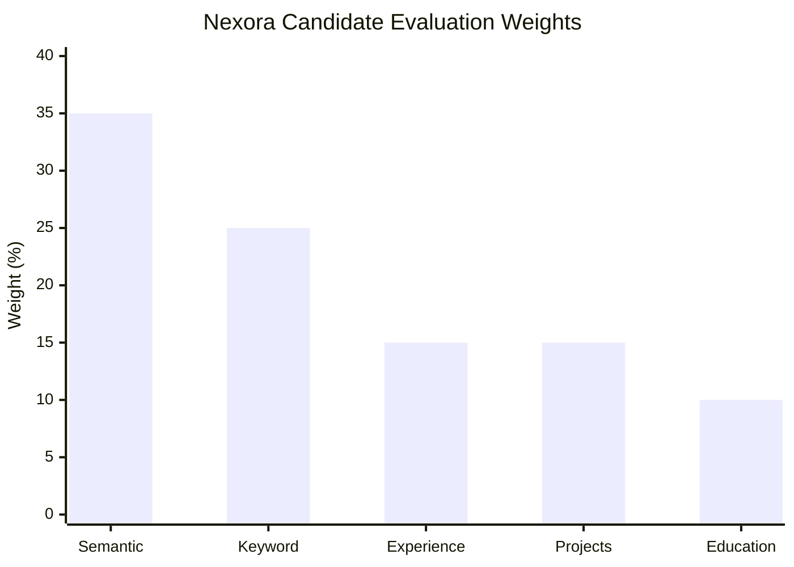
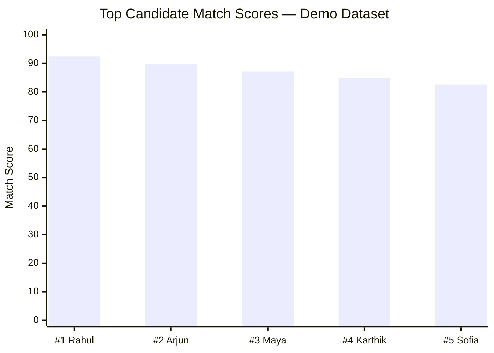
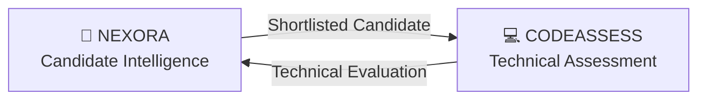
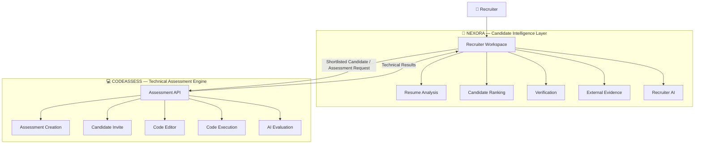
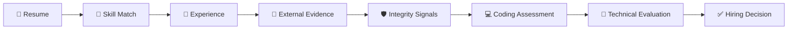
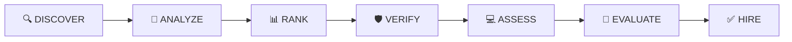

# 🚀 Nexora

### **AI-Powered Candidate Intelligence for Better Hiring**

> **Analyze. Verify. Assess. Hire.**

Nexora is an AI-assisted hiring intelligence platform designed to help recruiters move from **resume screening to evidence-backed candidate selection and technical assessment** in one unified workflow.

Instead of treating a resume as the final source of truth, Nexora combines **candidate matching, skill analysis, verification signals, external evidence, recruiter intelligence, and AI-powered coding assessment** to provide a more complete picture of every candidate.

**Resume → Intelligence → Verification → Technical Assessment → Hiring Decision**

---

## 🧠 What is Nexora?

Traditional hiring workflows often depend heavily on resumes and manual screening.

This creates three major problems:

* 🔍 Recruiters spend too much time manually reviewing large candidate pools.
* ⚠️ Resume information can be incomplete, inconsistent, exaggerated, or manipulated.
* 💻 A strong resume does not necessarily translate into strong technical ability.

**Nexora addresses this by turning candidate information into an explainable hiring intelligence layer.**

The platform progressively evaluates candidates through:

```text
Job Description
      ↓
Resume Parsing & Normalization
      ↓
Candidate Intelligence
      ↓
Skill & Experience Matching
      ↓
Verification & Evidence Analysis
      ↓
Recruiter Workspace
      ↓
AI Coding Assessment
      ↓
Technical Evaluation
      ↓
Evidence-Based Hiring Decision
```

---

# 📊 Candidate Evaluation Model

Nexora's bundled candidate analysis uses a weighted evaluation model that combines multiple dimensions rather than relying on a single signal.



### Evaluation dimensions

| Dimension         |  Weight | Purpose                                           |
| ----------------- | ------: | ------------------------------------------------- |
| 🧠 Semantic Match | **35%** | Measures conceptual alignment with the role       |
| 🔑 Keyword Match  | **25%** | Measures explicit skill/technology overlap        |
| 💼 Experience     | **15%** | Evaluates relevant professional experience        |
| 🛠️ Projects      | **15%** | Evaluates practical project evidence              |
| 🎓 Education      | **10%** | Adds educational context to the candidate profile |

This makes the ranking **multi-dimensional and explainable**, allowing recruiters to understand what contributes to a candidate's score.

---

# 📈 Example Candidate Ranking

The current bundled demo dataset contains ranked candidates with scores calculated on a 100-point scale.



> **Note:** This visualization represents the repository's bundled demo candidate data, not production hiring statistics.

The important idea is that Nexora does not stop at ranking candidates. It provides the evidence behind the ranking so recruiters can investigate **why** a candidate scored highly and where potential gaps exist.

---

# 🧩 Core Capabilities

## 1. 🧠 Intelligent Candidate Shortlisting

Nexora evaluates a candidate pool against a target job description and produces an explainable ranking rather than relying on a single opaque score.

The candidate intelligence layer surfaces:

* Overall candidate match
* Relevant skills
* Missing skills
* Required vs preferred skills
* Skill coverage across the candidate pool
* Relevant experience
* Project relevance
* Candidate comparisons
* Ranking explanations
* Strong and weak matches

### Example

```text
Job Requirement
      │
      ├── Python       ✓ Strong
      ├── React        ✓ Strong
      ├── SQL          ✓ Strong
      ├── TypeScript   ✓ Strong
      ├── Angular      ⚠ Missing
      ├── AWS          ✓ Preferred
      └── Docker       ✓ Preferred
```

The recruiter can therefore see **which skills are actually supported by candidate evidence** rather than simply receiving a percentage.

---

# 📄 2. Resume Intelligence

Candidate resumes are transformed into structured information that can be used throughout the hiring workflow.

Nexora can work with:

* 🎓 Education
* 💼 Work experience
* 🛠️ Technical skills
* 🚀 Projects
* 📌 Relevant experience
* 🔗 External profiles
* 🛡️ Verification signals
* 📑 Resume metadata

The structured candidate profile allows recruiters to move from raw documents to an actionable candidate dossier.

---

# 🛡️ 3. Verification & Integrity Signals

A major component of Nexora is identifying signals that may require additional recruiter review.

The platform supports verification concepts such as:

* ⚠️ Suspicious resume/content signals
* 🔎 Verification alerts
* 📅 Timeline overlap detection
* 📄 Resume integrity indicators
* 🧩 Claims-vs-evidence comparison
* 🔗 External profile verification
* 👀 Review recommendations

For example:

```text
Candidate claims
      ↓
"3 years Python experience"
      ↓
Nexora searches available evidence
      ↓
Projects + Work History + External Evidence
      ↓
┌──────────────────────────────┐
│ Evidence Strength: STRONG    │
└──────────────────────────────┘
```

Importantly, verification signals are intended as **decision-support evidence**, not automatic proof of fraud.

---

# 🔗 4. Evidence Beyond the Resume

A resume alone provides only a limited picture of a candidate.

Nexora therefore supports external candidate evidence through:

### 💼 LinkedIn

Professional identity, career history, and experience context.

### 💻 GitHub

Public repositories, technical projects, and coding activity.

### 🌐 Portfolio

Personal projects and demonstrated capabilities.

These signals help recruiters cross-reference candidate claims with available external evidence.

---

# 📊 5. Recruiter Intelligence Dashboard

Nexora is designed around a recruiter-first workspace rather than a raw data interface.

The dashboard provides:

* 👥 Candidate overview
* 🔎 Candidate search
* 📊 Candidate ranking
* 🧩 Skill coverage analysis
* 👤 Candidate detail views
* ⚖️ Candidate comparison
* 📈 Hiring analytics
* 🛡️ Verification alerts
* 🤖 Recruiter AI assistance

The goal is simple:

> **Give recruiters the information they need without forcing them to manually assemble it from multiple sources.**

---

# 🤖 6. Recruiter AI Assistant

Nexora includes a recruiter-facing conversational layer for interacting with candidate intelligence.

Recruiters can ask questions such as:

```text
Why is this candidate ranked first?

Compare candidate 1 and candidate 2.

Who has the strongest React experience?

Which candidates are missing Docker?

Which candidates have backend experience?

Which candidates require verification review?

What are the biggest skill gaps in the candidate pool?
```

The assistant is designed as an **interface over structured hiring intelligence**, rather than a generic chatbot.

---

# 💻 AI Coding Assessment Integration

## CodeAssess

Once a recruiter shortlists a candidate, Nexora can move the candidate into the technical validation stage through the **AI Coding Assessment** platform.

CodeAssess is a separate full-stack assessment engine providing:

* 📝 Assessment creation
* ❓ Coding questions
* 🔗 Candidate-specific invite links
* 💻 Browser-based coding environment
* ▶️ Code execution
* 📤 Solution submission
* 🤖 AI-based evaluation
* 📊 Structured technical reports

The assessment platform supports Python, C++, Java, and text/theory questions, with AI evaluation performed through an LLM accessed through OpenRouter.

---

# 🔄 Integrated Hiring Workflow

```mermaid
flowchart LR
    A["📄 Job Description"] --> B["📥 Resume Pool"]
    B --> C["🧠 Nexora Intelligence"]
    C --> D["📊 Candidate Ranking"]
    D --> E["🛡️ Verification"]
    E --> F["👤 Recruiter Review"]
    F --> G["💻 CodeAssess"]
    G --> H["🤖 AI Code Evaluation"]
    H --> I["📈 Technical Evidence"]
    I --> J["✅ Hiring Decision"]
```



---

# 🔗 Nexora × CodeAssess

Two specialized systems come together to create one hiring workflow.



### Nexora handles

* Resume analysis
* JD matching
* Candidate ranking
* Skill-gap analysis
* Verification signals
* LinkedIn / GitHub / Portfolio evidence
* Candidate comparison
* Recruiter AI
* Hiring analytics

### CodeAssess handles

* Assessment creation
* Coding questions
* Candidate invite links
* Browser-based coding
* Code execution
* Solution submission
* AI evaluation
* Technical reports

Together:

> **Nexora determines who deserves deeper evaluation. CodeAssess determines how well they can demonstrate their technical ability.**

---

# 🏗️ System Architecture



---

# 🔌 Integration Boundary

The two applications remain modular.

```text
┌─────────────────────────────┐
│          NEXORA             │
│                             │
│ Candidate Intelligence      │
│ Ranking                     │
│ Verification                │
│ Recruiter Workspace         │
└─────────────┬───────────────┘
              │
              │ API / Adapter
              ▼
┌─────────────────────────────┐
│         CODEASSESS          │
│                             │
│ Assessment Management       │
│ Candidate Invites           │
│ Code Execution              │
│ AI Evaluation               │
└─────────────────────────────┘
```

This approach provides:

* 🔧 Independent development
* 🚀 Independent deployment
* 🐛 Easier debugging
* 🧩 Clear service boundaries
* ♻️ Reusable assessment infrastructure
* 🔄 Future extensibility

Rather than copying the entire CodeAssess application into Nexora, Nexora communicates with the assessment engine through a small integration/API layer.

---

# 🛠️ Technology Stack

## Nexora

| Layer                           | Technology                |
| ------------------------------- | ------------------------- |
| ⚛️ Frontend                     | React + TypeScript        |
| ⚡ Build Tool                    | Vite                      |
| 🧭 Routing                      | React Router              |
| 🔐 Authentication               | Firebase                  |
| 🗄️ Data / Backend Connectivity | Supabase                  |
| 🌐 HTTP Client                  | Axios                     |
| 🎨 UI                           | Custom CSS + Lucide React |
| 📊 Visualization                | Recharts                  |
| 📄 PDF Processing               | PDF.js                    |
| 📝 Document Processing          | Mammoth                   |
| ✨ Animation                     | Motion                    |
| 🔔 Notifications                | Sonner                    |

## CodeAssess

| Layer             | Technology                   |
| ----------------- | ---------------------------- |
| ⚛️ Frontend       | Next.js + React + TypeScript |
| 💻 Editor         | Monaco Editor                |
| ⚡ Backend         | FastAPI                      |
| 🗄️ Database      | SQLite / PostgreSQL          |
| 🧱 ORM            | SQLAlchemy                   |
| ✅ Validation      | Pydantic                     |
| 🤖 AI             | OpenRouter                   |
| ▶️ Code Execution | Python / C++ / Java          |
| ☁️ Deployment     | Vercel + Render              |

---

# 📁 Project Structure

```text
Nexora/
│
├── frontend/
│   ├── src/
│   │   ├── components/
│   │   │   ├── CandidateAssessmentPortal.tsx
│   │   │   ├── CandidateComparisonModal.tsx
│   │   │   ├── CandidateDetailView.tsx
│   │   │   ├── CreateJobModal.tsx
│   │   │   ├── HiringSimulator.tsx
│   │   │   ├── JobCandidatesView.tsx
│   │   │   ├── JobOpeningsTable.tsx
│   │   │   ├── RecruiterChatbot.tsx
│   │   │   ├── ResumeViewerModal.tsx
│   │   │   ├── SkillCandidatesDrawer.tsx
│   │   │   └── SkillCoverageTable.tsx
│   │   │
│   │   ├── auth/
│   │   ├── services/
│   │   ├── types.ts
│   │   ├── data.ts
│   │   ├── main.tsx
│   │   └── styles.css
│   │
│   ├── package.json
│   └── vite.config.ts
│
├── backend/
│   ├── app/
│   │   ├── auth.py
│   │   ├── config.py
│   │   ├── container.py
│   │   ├── db.py
│   │   ├── main.py
│   │   ├── models.py
│   │   ├── schemas.py
│   │   ├── providers/
│   │   ├── routes/
│   │   └── services/
│   ├── requirements.txt
│   └── README.md
│
├── fraud_detection/
│   └── Resume integrity / fraud-analysis service
│
├── stt_service/
│   └── Speech-to-text / voice interaction service
│
├── mywork/
│   └── Supporting Nexora / evidence / assessment integration work
│
├── resume_analyzer.py
├── extraction.py
├── normalization.py
├── skill_extraction.py
├── semantic_matching.py
├── keyword_matching.py
├── chatbot_stt_schema.sql
└── resume_screening_supabase_schema.sql
```

---

# 🎙️ Voice & Interaction Layer

Nexora also contains a dedicated speech-to-text service that can support voice-driven recruiter interactions.

This opens the door to workflows such as:

```text
🎙️ Recruiter:
"Compare the top three candidates
and tell me who has the strongest
backend experience."

          ↓

      Speech-to-Text

          ↓

    Recruiter AI Layer

          ↓

 Candidate Intelligence

          ↓

📊 Evidence-backed response
```

This makes the system more natural for recruiters who want to interact with the hiring workspace conversationally.

---

# 🚀 Getting Started

## 1. Clone Nexora

```bash
git clone https://github.com/Sanjayram3269/Nexora.git
cd Nexora
```

## 2. Backend Setup

Set up a Python virtual environment and install dependencies:

```bash
python -m venv venv
source venv/bin/activate  # On Windows: .\venv\Scripts\activate
pip install -r requirements.txt
```

Configure backend environment variables in `.env`:

```env
# Supabase Configuration
SUPABASE_URL=https://your-project-ref.supabase.co
SUPABASE_SERVICE_ROLE_KEY=your-supabase-service-role-key

# Assessment & AI Configuration (Optional / Local Dev)
NEXORA_AUTH_MODE=development
NEXORA_CODEASSESS_MODE=mock
NEXORA_EMAIL_MODE=logging
CODING_ASSESSMENT_API_URL=http://127.0.0.1:8000
CODING_ASSESSMENT_FRONTEND_URL=http://localhost:3000
```

Start the FastAPI backend:

```bash
uvicorn backend.app.main:app --reload --port 8000
```

## 3. Frontend Setup

Navigate to the frontend directory and install dependencies:

```bash
cd frontend
npm install
```

Configure frontend environment variables in `frontend/.env`:

```env
# Supabase Database & Storage Configuration
VITE_SUPABASE_URL=https://your-project-ref.supabase.co
VITE_SUPABASE_ANON_KEY=your-supabase-anon-public-key

# API Backend (Defaults to /api proxied to http://127.0.0.1:8000)
VITE_API_URL=/api

# Optional: Firebase Authentication
VITE_FIREBASE_API_KEY=
VITE_FIREBASE_AUTH_DOMAIN=
VITE_FIREBASE_PROJECT_ID=
VITE_FIREBASE_STORAGE_BUCKET=
VITE_FIREBASE_MESSAGING_SENDER_ID=
VITE_FIREBASE_APP_ID=
```

> ⚠️ Never commit API keys, credentials, tokens, or other secrets to version control.

## 4. Start Nexora Frontend

```bash
npm run dev
```

The Vite development server will start the recruiter workspace locally at `http://localhost:5173`.

---

# 💻 Running CodeAssess

Clone the assessment engine separately:

```bash
git clone https://github.com/Sanjayram3269/AI-Coding-Assessment.git
cd AI-Coding-Assessment
```

### Backend

```bash
cd backend

python -m venv venv
```

### Windows

```bash
.\venv\Scripts\Activate.ps1
```

### macOS / Linux

```bash
source venv/bin/activate
```

Install dependencies:

```bash
pip install -r requirements.txt
```

Configure:

```env
OPENROUTER_API_KEY=your_openrouter_api_key
OPENROUTER_MODEL=openrouter/free
```

Run the backend:

```bash
uvicorn app.main:app --reload --host 127.0.0.1 --port 8000
```

### Frontend

```bash
cd frontend
npm install
npm run dev
```

---

# 🔁 End-to-End Example

A typical recruiter workflow looks like this:

### 01 — Create a job analysis

Recruiter uploads or provides a job description.

### 02 — Add candidate resumes

Nexora parses and normalizes the candidate pool.

### 03 — Analyze candidates

The system evaluates:

* Semantic similarity
* Keyword alignment
* Skills
* Experience
* Projects
* Education

### 04 — Rank candidates

Candidates are ordered using the multi-dimensional evaluation model.

### 05 — Investigate evidence

Recruiter opens a candidate and reviews:

* Resume
* Skills
* Projects
* Work history
* LinkedIn
* GitHub
* Portfolio
* Verification signals

### 06 — Shortlist

Recruiter selects candidates for deeper evaluation.

### 07 — Generate coding assessment

Nexora sends the candidate into CodeAssess.

### 08 — Candidate solves the assessment

The candidate:

```text
Open Invite
    ↓
Read Question
    ↓
Write Code
    ↓
Run Code
    ↓
Submit
```

### 09 — AI evaluates the solution

CodeAssess evaluates:

* Correctness
* Efficiency
* Code quality
* Complexity
* Strengths
* Issues
* Improvements

### 10 — Recruiter receives stronger evidence

The technical result can be brought back into the Nexora hiring workflow.

---

# 📊 From Resume Score to Technical Evidence

The key product principle is **progressive evidence**.



Each stage adds another layer of evidence.

The goal is not to replace recruiter judgment.

The goal is to make that judgment **faster, more informed, and more evidence-driven**.

---

# 🎯 Why Nexora?

| Traditional Hiring              | Nexora                         |
| ------------------------------- | ------------------------------ |
| 📄 Resume-first                 | 🧠 Evidence-first              |
| 🔍 Manual screening             | ⚡ AI-assisted screening        |
| 📊 Basic ranking                | 📈 Explainable ranking         |
| ❓ Claims accepted at face value | 🔎 Claims vs evidence          |
| 🧑‍💼 Manual comparison         | ⚖️ Candidate comparison        |
| 💻 Separate technical testing   | 🔗 Integrated assessment       |
| 📑 Multiple disconnected tools  | 🧩 Unified workflow            |
| 🤷 "Why this candidate?"        | 💡 Evidence-backed explanation |

---

# 🧭 Design Principles

### 🧠 Explainability

Recruiters should understand **why** candidates are recommended.

### 🔎 Evidence over claims

Candidate decisions should be supported by multiple signals instead of relying exclusively on resume text.

### 👤 Human-in-the-loop

Nexora assists recruiters rather than making irreversible hiring decisions automatically.

### 🧩 Modular architecture

Candidate intelligence and technical assessment remain separable services.

### 📈 Progressive evaluation

Candidates move through increasingly stronger evidence layers.

---

# 🔐 Security & Responsible Use

Nexora may process candidate information and should therefore be deployed with appropriate security controls.

Important considerations:

* 🔑 Never commit API keys or credentials.
* 🔒 Protect candidate information.
* 🔗 Secure candidate assessment links.
* 🛡️ Treat verification alerts as review signals rather than automatic fraud verdicts.
* 👤 Keep humans involved in final hiring decisions.
* 🔐 Implement proper authentication and authorization before production deployment.
* 📦 Sandbox untrusted code execution before publicly exposing the assessment service.

The current CodeAssess implementation uses subprocess-based code execution and should receive stronger isolation before being used for untrusted, production-scale submissions.

---

# 🚧 Roadmap

## 🧠 Candidate Intelligence

* [ ] Stronger semantic resume/JD matching
* [ ] Improved candidate evidence extraction
* [ ] Configurable ranking weights
* [ ] Better explanation generation
* [ ] Candidate-specific recommendation reasoning

## 🛡️ Verification

* [ ] Deeper GitHub analysis
* [ ] LinkedIn/profile consistency checks
* [ ] Portfolio evidence extraction
* [ ] Improved document-integrity detection
* [ ] Additional anomaly detection signals
* [ ] More robust timeline verification

## 💻 Assessment

* [ ] One-click assessment generation
* [ ] Assessment-result synchronization into Nexora
* [ ] Technical score inside recruiter dashboard
* [ ] Combined resume + technical ranking
* [ ] Skill-specific coding assessments
* [ ] Interview question generation from assessment gaps

## 🤖 Recruiter AI

* [ ] Evidence-grounded candidate Q&A
* [ ] Candidate comparison summaries
* [ ] Explainable recommendations
* [ ] Interview question generation
* [ ] Assessment-result interpretation
* [ ] Voice-driven recruiter workflows

---

# 🌐 End-to-End Vision

Nexora is designed to become a **candidate intelligence layer for the entire hiring lifecycle**.

Instead of asking:

> **"Does this resume look good?"**

Nexora enables recruiters to ask:

> **"Does this candidate match the role, can we verify the evidence, can they demonstrate the required skills, and what should we do next?"**

The complete workflow becomes:



---

# 🏆 The Bigger Idea

> ### **A resume tells you what a candidate claims.**
>
> ### **Evidence tells you what they have done.**
>
> ### **Assessment tells you what they can demonstrate.**
>
> ### **Nexora brings all three together.**

---

# 🔗 Repositories

### 🧠 Nexora — Candidate Intelligence

**Repository:**
https://github.com/Sanjayram3269/Nexora

### 💻 AI Coding Assessment — CodeAssess

**Repository:**
https://github.com/Sanjayram3269/AI-Coding-Assessment

---

# 🤝 Contributing

Contributions, ideas, improvements, and feedback are welcome.

If you want to improve Nexora:

```text
Fork
  ↓
Create Branch
  ↓
Build
  ↓
Test
  ↓
Pull Request
  ↓
🚀 Improve Hiring Intelligence
```

---

# 📜 License

This project is provided as-is for **educational, experimental, and hackathon development purposes**.

---

<div align="center">

### 🚀 Nexora

**Smarter Hiring. Real Talent.**

*Evaluate potential. Enable opportunity.*

**Analyze • Verify • Assess • Hire**

</div>
